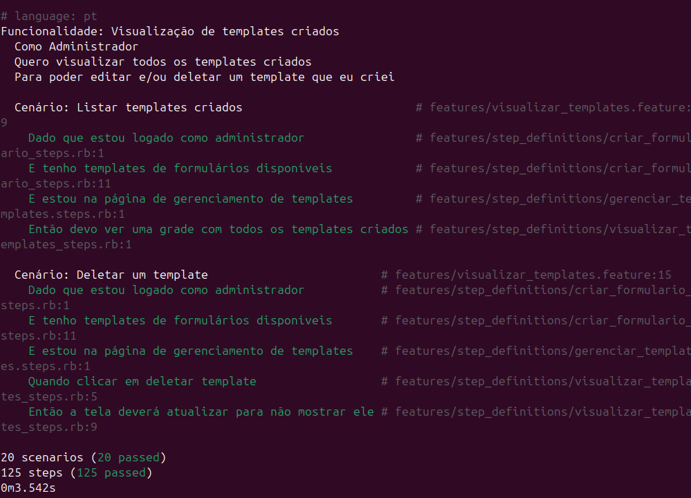
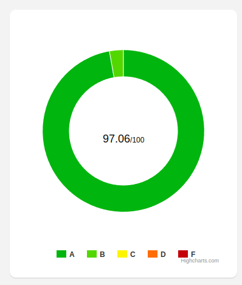
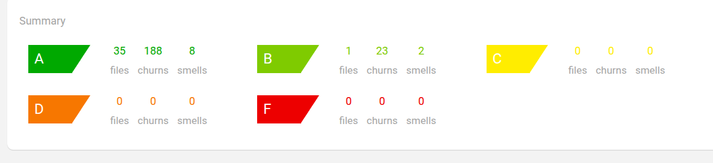
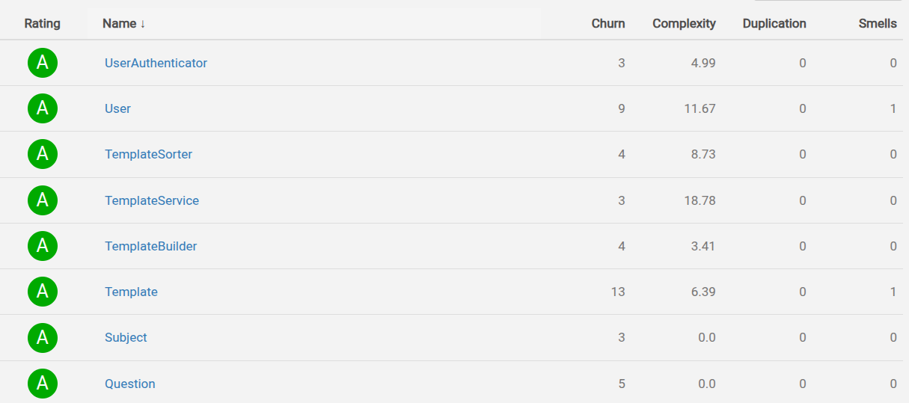
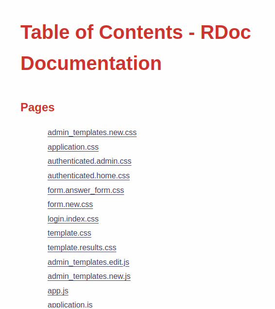
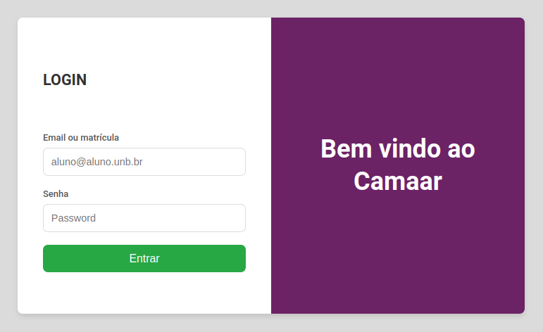
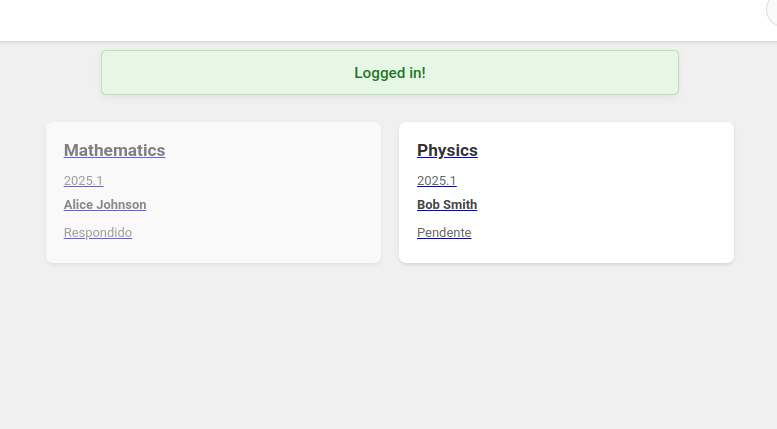
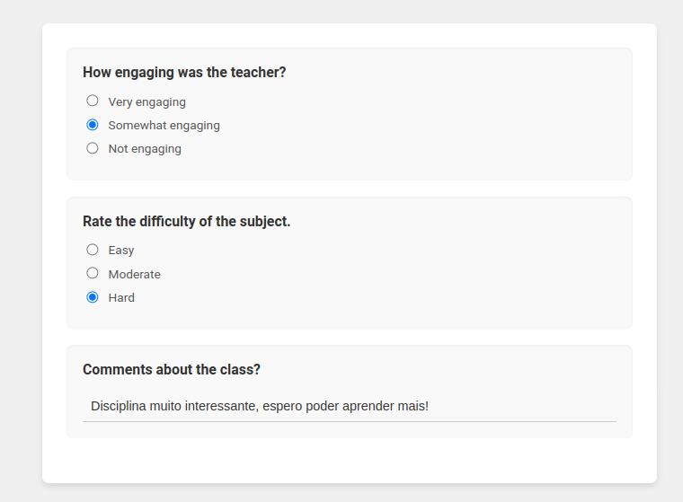
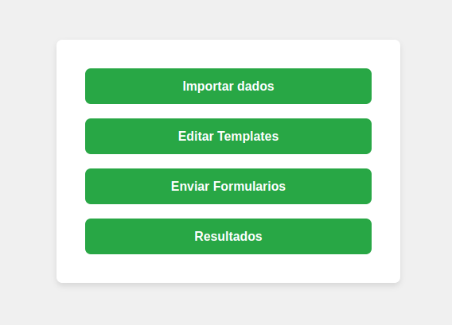

## Wiki

- DIOGO BORGES SILVA 232035914
- ALAN MAGALHAES FLORENCIO 221037376
- PEDRO HENRIQUE SOUZA DOS SANTOS 202037604
- THIAGO VERAS RODRIGUES QUEIROZ 211055370
- MAXWELL OLIVEIRA DOS REIS 221002100

O repositório está presente no seguinte [link](https://github.com/diogob003/CAMAAR)

O esquema de branch utilizado será de uma branch por feature. Ou seja, haverá uma branch para trabalhar na autenticação, outra para a visualização de formulários e etc. Algumas branchs tem o nome no formato "CAM-3" ou "CAM-19", esse nome representa CAM = CAMAAR e o numero representa o número da issue correspondende no repositório. 

### Sprint 1

As definições dos primeiros papéis foram as seguintes

- Product Owner Pedro
- Scrum Master Alan

Além disso, nessa primeira sprint, definimos as funcionalidades, cenários e perguntas no modelo BDD. Os resultados podem ser encontrados na pasta na pasta bdd [repositório](https://github.com/diogob003/CAMAAR/tree/main)

### Sprint 2

Nessa sprint tivemos avanços na implementação do sistema. Foi possível desenhar todo o layout do sistema, incluindo a página de administração, resposta de formulários, admin e etc, seguindo fielmente o design do figma dado. Além disso, já é possível autenticar no sistema por meio de email ou matrícula, visualizar os formulários disponíveis para suas turmas, visualizar suas perguntas e respondê-lo. Seguinte a numeração das issues originais, segue a lista das features implementadas:

- Autenticação por matricula ou email (Diogo)
- Listagem de formulários (Maxwell)
- Visualização / submissão de respostas de um formulário (Maxwell)

Note que, para todas as features citadas, há testes BDD também implementados usando o cucumber. Os arquivos .feature já estão disponíveis para todas as issues, mas alguns ainda não foram realmente implementados. Sendo assim, recomenda-se executar o cucumber com o seguinte comando

> bundle exec cucumber --tags "not @ignore" --publish-quiet

De modo a ignorar os testes ainda implementados e rodar apenas os cenários existentes.

A branch criada para essa sprint se chama "sprint-2" e é dela que faremos o pull-request no repositório original.

### Sprint 3

Nessa sprint trabalhamos na finalização da implmentação das features e testes, além da refatoração e documentação. Assim, segue a lista das issues que foram implementadas e seus respectivos autores:

- Autenticação por matricula ou email (Diogo)
- Listagem de formulários (Maxwell)
- Visualização / submissão de respostas de um formulário (Maxwell)
- Criação, edição e deleção de templates (Maxwell)
- Criação e deleção de formulários (Maxwell)
- Geração de CSV com resultados de um formulário (Maxwell)

Para todas as issues citadas, há testes implementados usando a ferramenta Cucumber e Capybara. Temos 20 cenários e 125 passos implementados e funcionando. Dentre os cenários citados, há tanto casos de "happy path" quanto de "sad path". 

Para rodar esses testes, basta executar o seguinte comando estando na pasta /src do projeto.

> bundle exec cucumber --publish-quiet

O resultado será como na imagem a seguir.

Além dos testes via cucumber, nessa sprint instalamos a gema rubycritic para analise de código. Assim, para melhorar as métricas dadas, houve uma grande refatoração em praticamente todos os controllers e métodos. Atualmente, o rubycritic está gerando excelentes resultados que comentaremos a seguir.

O gráfico gerado pela ferramenta dá uma pontuação de 97.06 pontos para o código do projeto, podendo ser confirmada com o seguinte gráfico.

Além disso, ao listar os arquivos por categoria, temos que, com exceção de um, todos eles tem nota A, que seria a melhor possível. A seguir, mostramos um sumário das informações do gráfico.

Na aba de código podemos ter os detalhes por arquivo. Aqui, conseguimos visualizar critérios como "churn", "complexity", "duplication" e "smells". Para este projeto, conseguimos reduzir a zero os numeros da categoria "duplication". O número de "smells" também está baixo, visto que o numero de smells por arquivo é majoritariamente zero. Por fim, para o critério de "complexity", temos que os valores sao, majoritariamente, menores que 25, tendo apenas pouquíssimas exceções.

A seguir, apresentamos uma imagem com alguns destes resultados por arquivo.

Para gerar esses resultados com o rubycritic, recomenda-se rodar o seguinte comando estando na pasta src do projeto

> bundle exec rubycritic app

Após a criação de testes e geração das métricas, o foco se tornou preparar a documentação do projeto. Assim, adicionamos uma explicação para cada método sobre o que ele é, o que faz, os parametros que recebe, efeito colateral e etc. Com o auxilio da ferramenta rdoc, uma página html foi gerada e é possível acessá-la para conferir estes resultados.

Ao acessar a página 

O comando para gerar esses docs foi o seguinte, sendo executado na pasta src do projeto.

> rdoc app

## Como usar o sistema:

Para utilizar o sistema, primeiro é necessário preparar o banco de dados. Há mais de uma forma de fazer isso, mas uma possibilidade é

> rails db:reset

O comando irá resetar o banco. Isso é, recriar e adicionar as entidades iniciais presentes no arquivo de "seeds.db". Após isso, basta rodar o projeto e acessar a porta 3000 no navegador. A seguinte tela aparecerá:

Nessa tela é possível inserir dados de 4 usuários distintos, dois professores e dois alunos. Os logins estão listados a seguir:

Professores:
- Alice Johnson, registro: T1001, email: alice.johnson@example.com e senha: alice_jabberwock_password
- Bob Smith, registro: T1002, email: bob.smith@example.com e senha: bob_horse_password

Alunos:
- Charlie Brown, registro: S2001, email: charlie.brown@example.com e senha: charlie_bettery_password
- Diana Prince, registro: S2002, email: diana.prince@example.com e senha: diana_scorpion_password

Ao autenticar, será possível ver todos os formulários já criados pelo sistema. Por padrao, nos dados iniciais já inserimos alguns formulários com respostas.

Ao selecionar um formulário, será possível visualizar suas perguntas, opções e submeter as suas respostas.

Além dessas telas, também há toda a área do admin, que pode ser acessada pelo login dos professores. Lá é possível acessar as areas de administração, onde podemos gerenciar os templates, formulários, baixar resultados e etc.

